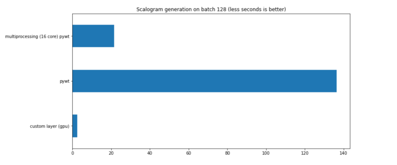

# cwtLayerKeras

  []() [](https://opensource.org/licenses/MIT)

This project main goal is to produce a simple way to compute **CWT** (Continuous Wavelet Transformation) scalogram on signals :satellite: with keras functional API.



The image above shows the performance of the layer on a TitanX GPU

## Installation
    pip install cwtLayerKeras

## Usage

```python
from cwtLayerKeras import Cwt as cwtt

# some code

def build_model():
    input_data = layers.Input(shape=(x_val.shape[-1],))
    cwt = cwtt(
        sample_count=x_val.shape[-1],
        scales_step=10,
        min_scale = 4,
        max_scale=224,
        output_size=(224, 224),
        depth_pad=2,
    )
    scalogram = cwt(input_data)
    base_model = EfficientNetB0(include_top=False, weights=None)(scalogram)

    x = layers.GlobalAveragePooling2D()(base_model)
    x = layers.BatchNormalization()(x)
    x = layers.Dropout(0.3)(x)

    predictions = layers.Dense(OUTPUT_SIZE, activation="softmax")(x)

    model = Model(inputs=input_data, outputs=predictions)

    model.summary()
    model.compile(
        optimizer="adam",
        loss="categorical_crossentropy",
        metrics=["accuracy"],
    )
    return model
```


## Parameters
Paramenter | Type | Description | Why
--- | --- | --- | ---
depth_pad | int | It allows to specify the number of padding channel that the layer need to add | some standard keras model (like efficientnet) need 3 channel depth to execute, instead of just the single one of the scalogram
max_scale|int|Highest wavelet's scale|
min_scale|int|Lowest wavelet's scale|
output_size|tuple|Size of the returned scalograms|
sample_count|int|# of Raman's shifts present in the tensor (in a tabular rapresentation,this number represent the amout of columns present in the table) |
scales_step|float|Change wavelet's scale by this range step|
trainable_kernels | bool | It make the wavelets that produce the scalogram trainable | interesting to see how/if the net optimizers change the wavelet kernel (research purpose)
wavelet|str|Wavelet kernel to use in the CWT. Now there are just "morl" (morlet), "mex_hat"/"rick" (mexican hat / ricker) |

More insightful informations can be found in the code's docs :wink:
## Disclaimer:

 :exclamation: This project was built for research purpose, so there could be some errors:exclamation:
 
 Feel free to open issues on those.
 
 Contributers are welcome :thumbsup:

